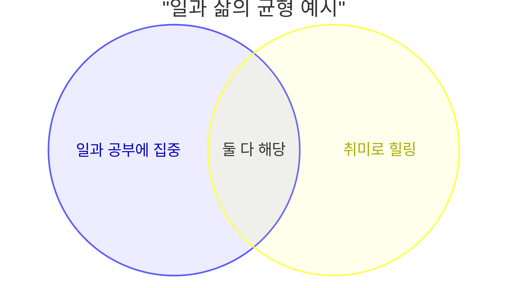
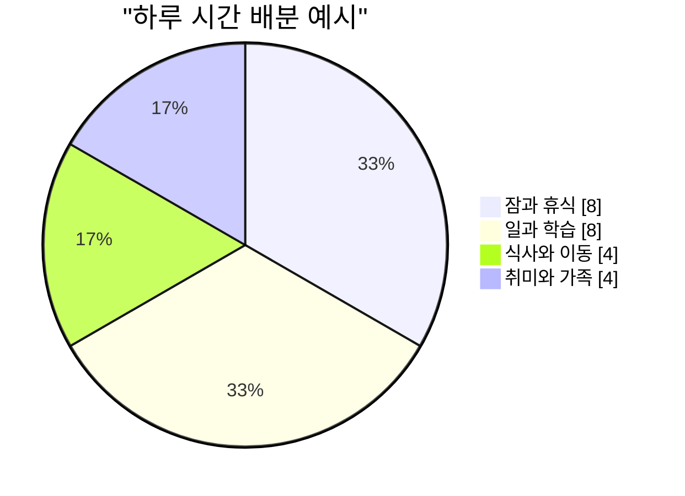

# 휴식 시간, 어디로 쓰고 있을까

아래 그림은 **같은 주제를 두 방식**으로 보여 줍니다.

- **벤 다이어그램(벤도)**: 겹치는 부분이 “둘 다 해당”하는 영역입니다.
- **원 그래프(파이 차트)**: 비율을 한눈에 보는 **인포그래픽**에 가깝게 표현했습니다.

## 벤 다이어그램 예시

> *일을 열심히 하는 사람*과 *취미를 즐기는 사람*이 **겹치는 부분**도 있다는 가상의 모양입니다. 숫자는 예시가 아니라 형태만 참고하시면 됩니다.

## 인포그래픽 느낌: 하루 시간 비율

하루 24시간을 대략 나눈 **비율**을 원으로 표현했습니다. 실제 생활과 다를 수 있습니다.

### 그림만 보고 기억할 점

- 벤도는 **교집합(겹침)**이 핵심입니다.
- 파이 차트는 **전체 중 몇 %**를 빠르게 전달할 때 쓰기 좋습니다.

---

*이 파일은 「벤 다이어그램 + 인포그래픽 스타일 도형」 예시용입니다.*
